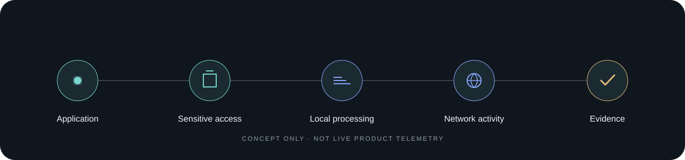

# Aegiscope

**See what your apps read, access and send.**

Aegiscope is an Application Privacy Observatory for Windows. It is being designed to connect sensitive local access, processing, network destinations and traffic into clear evidence.

> **Source code is currently private.** This public repository contains product information, documentation and release materials, not application source.



*Concept diagram only; it does not represent live telemetry.*

## The idea

An individual file read or network connection can be ordinary. Aegiscope is being built to help users see when events form a sequence worth reviewing:

```
Application → sensitive repository history access → large local artifact
            → external connection → significant outbound traffic
            → explainable privacy evidence
```

Important findings distinguish:

- **Observed** — directly supported by available telemetry.
- **Inferred** — a cautious interpretation of observed events.
- **Unknown** — what the telemetry cannot prove, such as the contents of encrypted HTTPS traffic.

Aegiscope will not claim a file was uploaded unless evidence establishes that fact.

## Status

Aegiscope is in development; **no production monitoring build or installer has been released**. Current private Windows development builds sample process identity and TCP connection metadata and report UDP local bindings. Optional per-connection TCP counters require an elevated token and were denied under the current validation token. Separate opt-in TCP and UDP user-ETW collectors report event-byte estimates; controlled traffic tests cover IPv4/IPv6 loopback. Direct production-collector probes validated one external IPv4/TCP HTTP request and one IPv4/UDP DNS query on a Windows 10 Enterprise build. A full packaged smoke also sent a bounded HTTP HEAD request to `example.com:80` and a DNS query to `1.1.1.1:53`; application-attributed, destination-specific estimates reached IPC and local SQLite. In that run, TCP estimates were 100/315 and UDP estimates 29/45 sent/received ETW event bytes for the exact remote endpoints. The TCP fixture sent no user data. HTTPS, other remote peers, remote IPv6, sustained traffic, other Windows builds, and service coverage remain unvalidated. These event-byte estimates are not confirmed delivered payload bytes. Aegiscope also has an opt-in sensitive-file ETW pipeline, but it has not produced validated live file-access records under the current token. An exact DNS answer-IP match observed up to 60 seconds before a TCP/UDP observation may be shown as a possible name; this is only an IP/time overlap, not application DNS attribution, and live DNS delivery remains unverified. Protected-folder notifications can provide post-notification logical-size and Windows-reported allocation-size metadata without identifying the writer. A controlled 2,500-file burst on one Windows 10 host drained without Agent-counted drops, but this does not prove complete Windows or filesystem delivery. These partial signals can feed cautious local correlation, but do not prove file creation, bytes written, file contents or what encrypted traffic carried. See the [detection capability matrix](docs/detection-capabilities.md) for exact limits.

## Principles

- Local analysis by default; no behavioral-history upload by default.
- Prefer metadata. Do not collect secret values, browser cookies, passwords or private-key contents.
- Explain the evidence and its limits.
- Summarize high-volume activity rather than flooding the interface.
- English default with Simplified Chinese in the same interface.

## Documentation

[Architecture](docs/architecture.md) · [Detection capabilities](docs/detection-capabilities.md) · [Privacy model](docs/privacy-model.md) · [Telemetry model](docs/telemetry-model.md) · [FAQ](docs/faq.md) · [Security](SECURITY.md) · [Privacy notice](PRIVACY.md) · [Binary software license notice](BINARY-EULA.md)

## Releases

No installer is available yet. A future Windows release will include version notes and a SHA-256 checksum. The application source will remain in a separate private repository unless announced otherwise.

## Community

Use the issue templates to report a bug, suggest a feature or report a false positive. Remove usernames, private paths, tokens, repository names and other personal data before attaching logs or screenshots.

## License

This repository's materials do not license the Aegiscope application. The official downloadable/installed binary will be governed by [BINARY-EULA.md](BINARY-EULA.md), whose final terms must be published before distribution. There is intentionally no generic `LICENSE` that could imply the closed-source software is open source.
